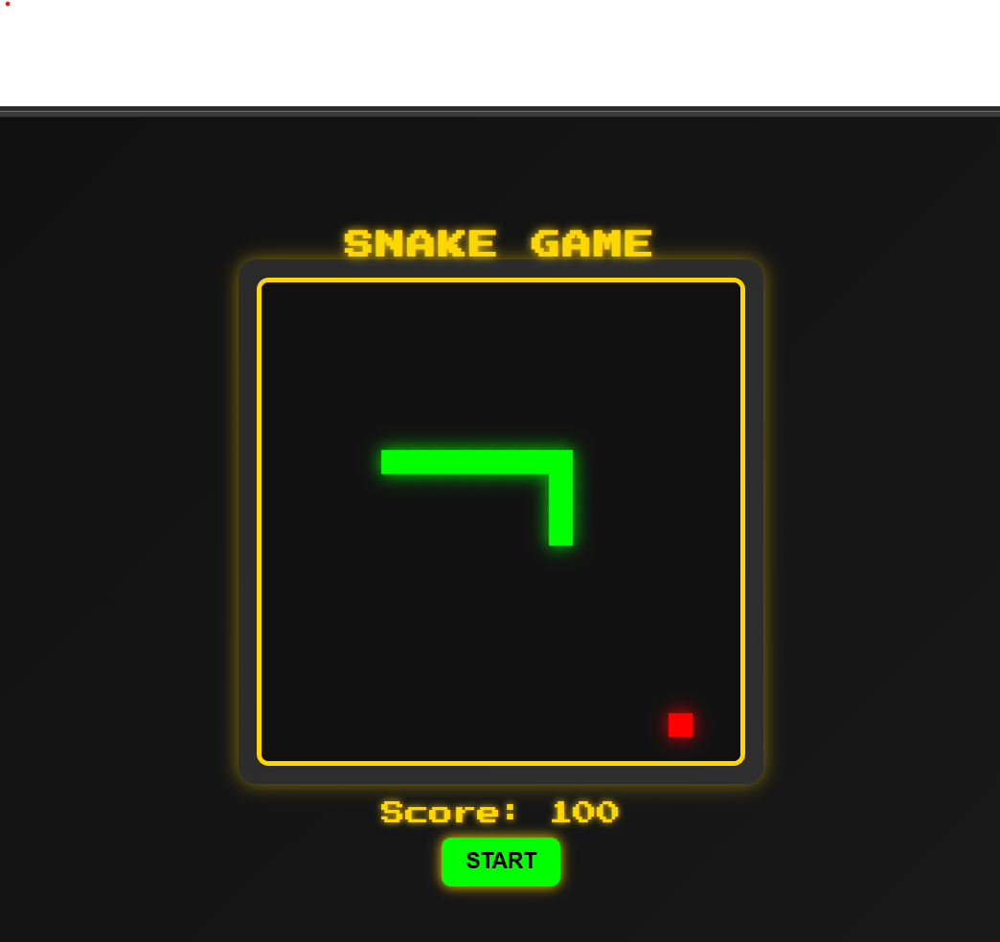

# 🐍 Neon Snake Game 🎮

A modern twist on the classic Snake Game with a **vibrant neon theme**! Control the glowing snake, eat food to grow, and avoid collisions to survive. Enjoy **smooth gameplay**, **real-time scoring**, and an immersive **retro-futuristic aesthetic**. 🚀

---

## 📸 Screenshot


---

## ✨ Features

✅ **Neon Aesthetic** - A glowing snake and food with a cyberpunk feel.
✅ **Smooth Gameplay** - Real-time movement and scoring updates.
✅ **Simple Controls** - Navigate using ⬆️⬇️⬅️➡️ arrow keys.
✅ **Start & Stop Buttons** - Pause and resume anytime.
✅ **Game Over Alert** - Try again with a replay option.

---

## 🕹️ How to Play

1️⃣ **Click Start** to begin the game.
2️⃣ **Use Arrow Keys** to move the snake.
3️⃣ **Eat Red Food** to grow and increase your score.
4️⃣ **Avoid Walls & Yourself** to stay in the game!

---

## 🛠️ Tech Stack

- **HTML** → Structure of the game.
- **CSS** → Neon styling & user interface.
- **JavaScript** → Game logic & movement.

---

## 🚀 Installation & Setup

1️⃣ **Clone the repository:**
```bash
git clone https://github.com/your-username/neon-snake-game.git
```
2️⃣ **Navigate to the project folder:**
```bash
cd neon-snake-game
```
3️⃣ **Open `index.html` in your browser** to start playing!

---

## 🤝 Contribute

Want to enhance the game? 🛠️ Feel free to **submit a pull request**!
You can:
- Improve animations 🎨
- Add sound effects 🎶
- Optimize performance ⚡

Star ⭐ the repository if you like the game! 😊

---

## 📜 License

This project is **open-source** and available under the [MIT License](LICENSE).

---

🎮 **Enjoy the game and happy coding!** 🐍🚀

